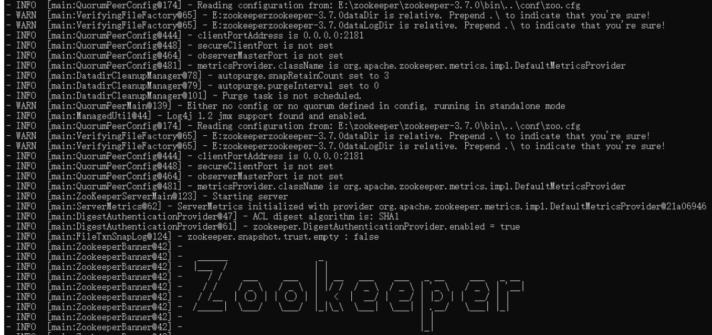
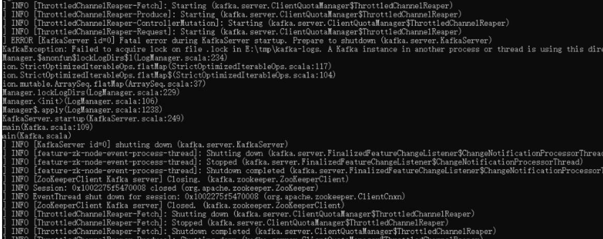
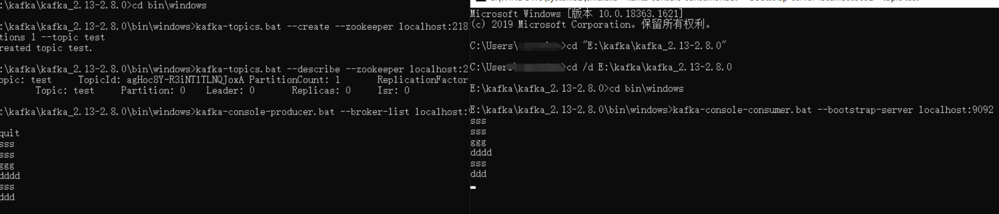

## **1.（必做）**

搭建一个 3 节点 Kafka 集群，测试功能和性能；实现 spring kafka 下对 kafka 集群的操作，将代码提交到 github。

1.配置环境变量
新建ZOOKEEPER_HOME=G:\bigdatatool\zookeeper-3.4.14
path添加%ZOOKEEPER_HOME%\bin;

2.在zookeeper的conf目录下将zoo_sample.cfg文件重命名为zoo.cfg
3.双击在zookeeper的bin目录下执行zkServer.cmd

4.打开cmd 进入kafka目录，执行以下命令启动kafka
修改server.properties文件里的用#注解“log.dirs=/tmp/kafka-logs”
.\bin\windows\kafka-server-start.bat .\config\server.properties

5.打开新的cmd命令窗口，在kafka的bin\windows目录下创建topic执行

kafka-topics.bat --create --zookeeper localhost:2181 --replication-factor 1 --partitions 1 --topic topic1

6.在kafka的bin\windows目录下打开新的cmd,执行命令添加生产者数据
kafka-console-producer.bat --broker-list localhost:9092 --topic topic1

7.创建了topic，有了生产者Producer，看看Consumer是否能够收到消息
在kafka的bin\windows目录下打开新的cmd，执行命令

## **6.（必做）**

思考和设计自定义 MQ 第二个版本或第三个版本，写代码实现其中至少一个功能点，把设计思路和实现代码，提交到 GitHub。

待补充