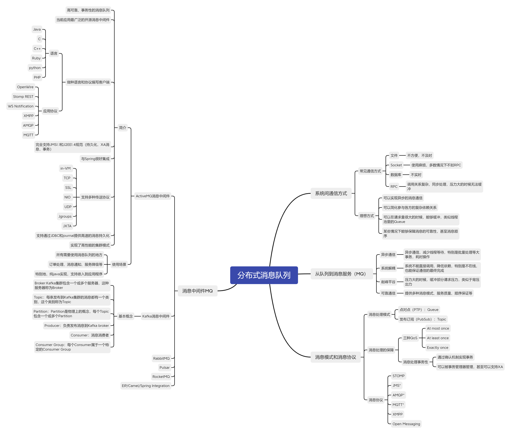

# 必做

分别用 100 个字以上的一段话，加上一幅图（架构图或脑图），总结自己对下列技术的关键点思考和经验认识

## JVM

JVM 是可运行 Java 代码的假想计算机，包含一套字节码指令集，一组寄存器，一个栈，一个垃圾回收，堆和一个存储方法域

JVM是运行在操作系统之上，他与硬件没有直接的交互，实现了 Java 的快平台运行

JVM 中的 GC 保证了内存的可用性，再学习中对 G1 GC 有新的认识和了解

学习 JVM 中尝试使用 Java 命令行工具 & GC 分析系统运行过程和其中产生的问题，同时使用可视化工具分析程序在 JVM 内存运行的状态

## NIO

**IO模型01--阻塞式IO（BIO）**

一般通过while(true)循环中服务端会调用accept()方法等待接收客户端的连接的方式监听请求，服务器一旦接收到一个连接请求，就可以建立通信套接字在这个通信套接字上进行读写操作，此时不能再接收其他客户端连接请求，只能等待通当前连接的客户端的操作执行完成，不过可以通过多线程开支持多个客户端的连接。

**IO模型02--非阻塞IO**

和阻塞IO类比，内核会理解返回，返回后获得足够的CPU时间继续做其他的事情。

用户进程第一个阶段不是阻塞的，需要不断的主动询问kernel数据好了没有，第二个阶段依然总是阻塞的。

**IO模型03--IO多路复用**

IO多路复用(IO multiplexing)，也称时间驱动IO(event-driven IO)，就是在单个线程里同事监控多个套接字，通过select或者poll轮询所负责的所有socket，当某个socket有数据到达了，就通知用户进程。

IO复用通非阻塞IO本质一样，不过是利用了新的select系统调用，有内核来负责本来是请求进程该做的轮询操作，看似比非阻塞IO还多了一个系统调用开销，不过因为可以支持多路IO，才算提高了效率。

进程先是阻塞在select/poll上，再是阻塞在读操作的第二个阶段。

**IO模型04--信号驱动IO**

信号驱动IO与BIO和NIO最大的区别就在于，在IO执行的数据准备阶段，不需要轮询。

当用户进程需要等待数据的时候，会向内核发送一个信号，告诉内核我要什么数据，然后用户进程就去做别的事情，而当内核准备好数据后，内核会立马给用户进程一个信号，说明数据已经准备好，用户进程接收到信号后，立马调用recvfrom，去查收数据。

**IO模型05--异步式IO**

异步IO真正实现了IO全流程的非阻塞。用户进程发出系统调用后立即返回，内核等待数据准备完成，然后将数据拷贝到用户进程缓冲区，然后发送信号告诉用户进程IO操作执行完毕（与SIGIO相比，一个是发送信号告诉用户进程数据准备完毕，一个是IO执行完毕）

## 并发编程

指在一台处理器上“同时”处理多个任务,

目标是充分的利用处理器的每一个核，以达到最高的处理性能。

**原子性：**

对基本数据类型的变量的读取和赋值操作是原子操作，即这些操作是不可被中断的，要么执行，要么不执行。

**可见性：**

java提供了volatile关键字来保证 可见性。

当一个共享变量被volatile修饰时，它会保证修改的值会立即被更新到主存，当有其他线程需要读取时，它会去内存中读取新值。

另外，通过synchronized和Lock也能保证可见性，synchronized和Lock保证同一时刻只有一个线程获取锁然后执行同步代码，并且在释放锁前会将对变量的修改刷新到主存中。

volatile并不保证原子性。

**有序性：**

java允许编译器和处理器对指令进行重排序，但是重排序过程不能影响到单线程程序的执行，却会影响到多线程并发执行的正确性。可以通过volatile关键字来保证一定的“有序性”（synchronized和Lock也可以）

## Spring 和 ORM 等框架

**pring framework6大模块**

Core：Bean/Context/AOP

Testing：Mock/TestContext

DataAccess：Tx/JDBC/ORM

Spring MVC/WebFlux：web

Integration：remoting/JMS/WS

Languages：Kotlin/Groovy

**Spring AOP**

接口类型：

默认使用jdkProxy--com.sun.Proxy.$Proxy

proxyTargetClass--EnhancerBySpringCGLIB

非接口类型：

默认使用CGlib--EnhancerBySpringCGLIB

## MySQL 数据库和 SQL

MySQL一般特制完整的MySQLRDBMS，是一个开源的关系型数据库管理系统（Relational Database Management System），现在属于Oracle公司。随着MySQL功能的不断完善，性能不断提高，又有开源免费的优势，越来越多的企业选择使用MySQL，而放弃商用收费的Oracle。

.png)

## 分库分表

关系型数据库本身比较容易成为系统瓶颈，单机存储容量、连接数、处理能力都有限。当单表的数据量达到1000W或100G以后，由于查询维度较多，即使添加从库、优化索引，做很多操作时性能仍下降严重。此时就要考虑对其进行切分了，切分的目的就在于减少数据库的负担，缩短查询时间。

## RPC 和微服务

RPC全称Remote Procedure Call，即远程过程调用。其本质上其实就是主机A通过某种网络协议向支持相同协议的主机B发送一个任务执行命令，并且在某些情况下，还能支持任务执行结果的返回。

随着时代的发展，互联网用户越来越多，系统之间调用越来越复杂，于是需要考虑系统扩容，出现了服务器集群，同事需要考虑多个相同服务如何管理，服务如何注册与发现、服务的限流降级熔断等治理问题，于是慢慢走向服务化的架构体系。

## 分布式缓存

在高并发的分布式的系统中，缓存是必不可少的一部分。没有缓存对系统的加速和阻挡大量的请求直接落到系统的底层，系统是很难撑住高并发的冲击，所以分布式系统中缓存的设计是很重要的一环。

## 分布式消息队列

**消息队列中间件**是分布式系统中重要的组件，主要解决应用耦合，异步消息，流量削锋等问题。实现高性能，高可用，可伸缩和最终一致性架构。是大型分布式系统不可缺少的中间件。 目前在生产环境，使用较多的消息队列有ActiveMQ，RabbitMQ，Kafka，RocketMQ等。

#  毕业总结

在学习完十五周的课程后，对 Java 有了一个全面的认识和构架，同时也认识到自己知识面的匮乏，在后期的学习中经常感到吃力，给予了我不小的挑战。如何进行高效合理的时间规划和个人自控，是我要经常解决的问题，好在还是跟上了学习进度，但在学习中仍有一些点没有理解透彻，仍是需要去不断查漏补缺的。